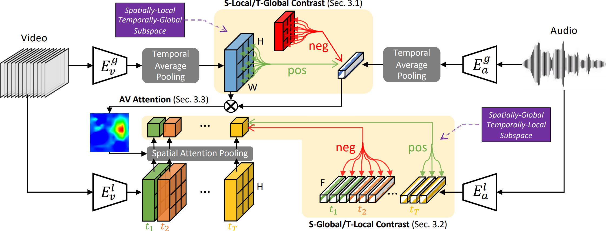

# Contrastive Learning of Global-Local Video Representations

This repository contains PyTorch implementation of the Global-Local network proposed in our 
paper [[Contrastive Learning of Global-Local Video Representations (NeurIPS 2021)]](https://arxiv.org/pdf/2104.05418.pdf).
The code is free to use for academic purpose only.





### Link:
* Shuang Ma, Zhaoyang Zeng, Daniel McDuff, Yale Song. Contrastive Learning of Global and Local Audio-Visual Representations. 
* [[Arxiv]](https://arxiv.org/pdf/2104.05418.pdf)
* [[OpenReview]](https://openreview.net/forum?id=txWfwhc6gi&referrer=%5BAuthor%20Console%5D(%2Fgroup%3Fid%3DNeurIPS.cc%2F2021%2FConference%2FAuthors%23your-submissions))


### Pretrain Instruction

Global-local pretraining on Kinetics


### create conda environment:
```
conda env create -f conda_env.yml

```

### Prepare dataset:

* Kinetics: [[Download]](https://deepmind.com/research/open-source/kinetics)
* UCF101: [[Download]](https://www.crcv.ucf.edu/research/data-sets/ucf101/)
* HMDB51: [[Download]](https://deepai.org/dataset/hmdb-51)
* LRW: [[Download]](https://www.robots.ox.ac.uk/~vgg/data/lip-reading/lrw1.html)


### Preprain your own model
```
bash run.sh

```


